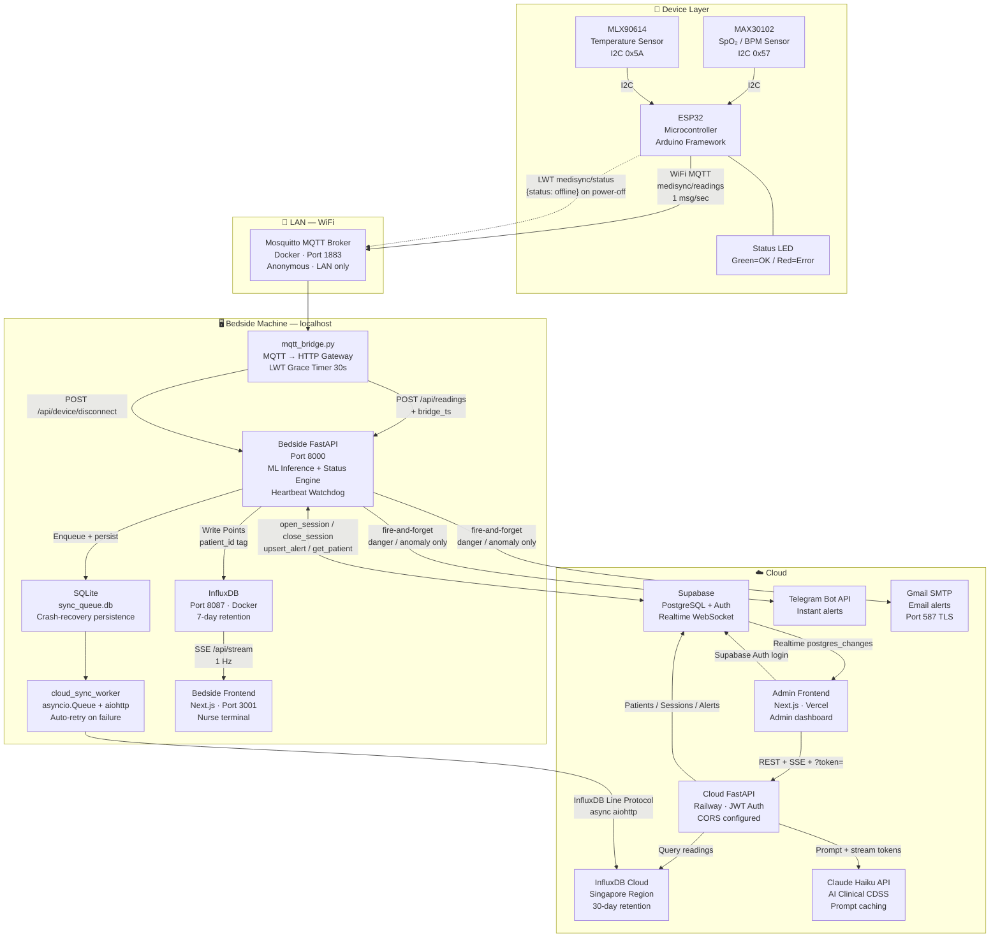
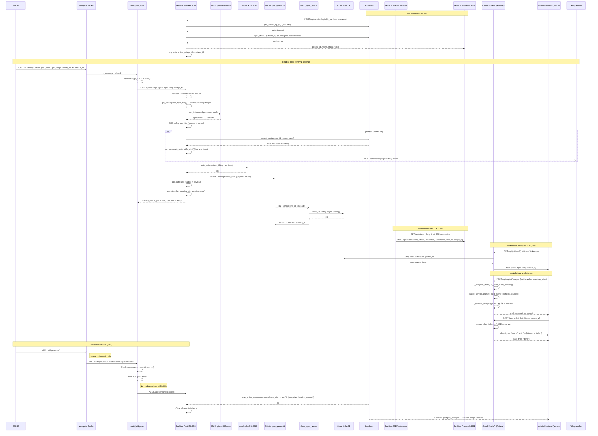
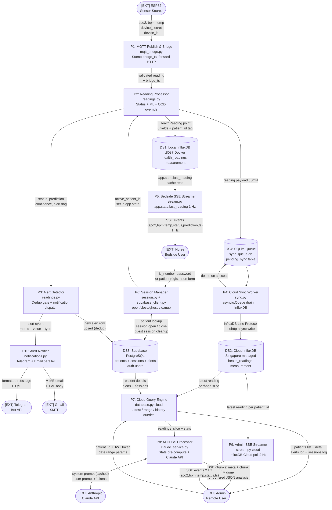
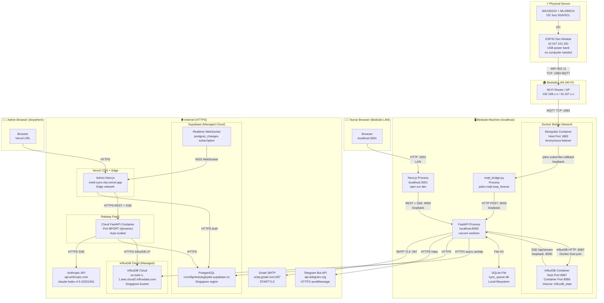
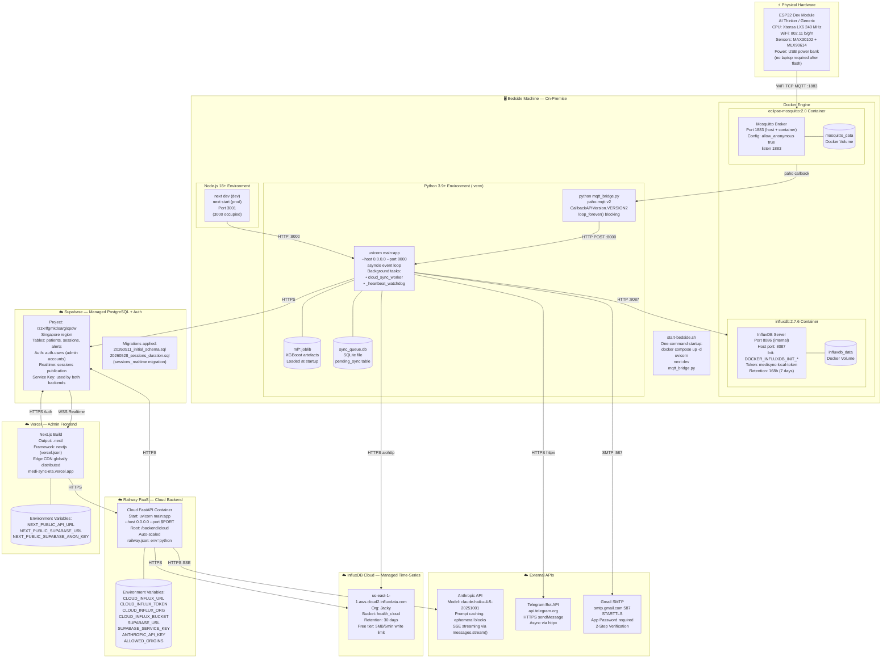

# MediSync — Complete Mermaid Diagrams

All 13 architecture diagrams for the MediSync real-time IoT patient health monitoring system.
Paste any individual block into [Mermaid Live Editor](https://mermaid.live) to render it.

---

## 1. System Architecture Diagram



---

## 2. Block Diagram

```mermaid
graph LR
    subgraph FW["Firmware Blocks — ESP32"]
        direction TB
        FW1["Sensor Block\nMAX30102 + MLX90614\nspO2 / BPM / Temp"]
        FW2["WiFi Stack Block\n802.11 b/g/n\nAuto-reconnect"]
        FW3["MQTT Publisher Block\nPubSubClient\nJSON 1 Hz"]
        FW4["LWT Config Block\nkeepalive=15s\nretain=true"]
        FW5["LED Controller Block\nGreen=OK / Red=Error"]
        FW1 --> FW3
        FW2 --> FW3
        FW4 --> FW3
        FW3 --> FW5
    end

    subgraph TRANSPORT["Transport Blocks"]
        direction TB
        TR1["MQTT Broker Block\nMosquitto Docker\n:1883 Anonymous"]
        TR2["MQTT Bridge Block\nmqtt_bridge.py\nQoS 1 subscriber"]
        TR3["LWT Handler Block\n30s Grace Timer\nRetain check"]
        TR1 --> TR2
        TR1 --> TR3
    end

    subgraph LOCAL_BE["Bedside Backend Blocks"]
        direction TB
        LB1["Readings Router Block\nPOST /api/readings"]
        LB2["Status Engine Block\nRule-based thresholds\nnormal/warning/danger"]
        LB3["ML Inference Block\nXGBoost 5-feature\nThreshold 0.5380"]
        LB4["OOD Safety Block\nDanger+Normal override"]
        LB5["Alert Block\nupsert_alert dedup\nSupabase write"]
        LB6["Sync Queue Block\nasyncio.Queue + SQLite\n5s retry backoff"]
        LB7["Notification Block\nTelegram + Email\nfire-and-forget"]
        LB8["SSE Stream Block\napp.state cache\n1 Hz cadence"]
        LB9["Session Router Block\nlogin/logout/active"]
        LB10["Heartbeat Watchdog Block\n10s poll / 300s timeout"]
        LB1 --> LB2
        LB1 --> LB3
        LB2 --> LB4
        LB3 --> LB4
        LB4 --> LB5
        LB5 --> LB6
        LB5 --> LB7
        LB1 --> LB8
        LB9 --> LB1
        LB10 --> LB9
    end

    subgraph CLOUD_BE["Cloud Backend Blocks"]
        direction TB
        CB1["Auth Middleware Block\nJWT Bearer / ?token=\nSupabase validation"]
        CB2["Patients Router Block\nGET /api/patients"]
        CB3["Stream Router Block\nSSE 2 Hz cloud poll"]
        CB4["History Router Block\nInfluxDB range query"]
        CB5["Alerts Router Block\nGET + PUT resolve-all"]
        CB6["Copilot Router Block\nPOST analyze + chat SSE"]
        CB7["Summary Router Block\nSSE streaming narrative"]
        CB8["Claude Service Block\nStats pre-compute\nPrompt caching\nValidation + fallback"]
        CB1 --> CB2
        CB1 --> CB3
        CB1 --> CB6
        CB1 --> CB7
        CB6 --> CB8
        CB7 --> CB8
    end

    subgraph STORAGE["Storage Blocks"]
        direction TB
        ST1["Local InfluxDB Block\n:8087 Docker\nhealth_readings"]
        ST2["Cloud InfluxDB Block\nSingapore managed\nhealth_readings"]
        ST3["Supabase Block\npatients + sessions + alerts"]
        ST4["SQLite Queue Block\npending_sync table"]
    end

    subgraph FE["Frontend Blocks"]
        direction TB
        FE1["Bedside Next.js Block\n:3001 Nurse terminal\nStatusCard + Gauges + LiveChart"]
        FE2["Admin Next.js Block\nVercel · Remote access\nPatientTable + ClinicalCopilot"]
    end

    FW -->|"MQTT publish\nWiFi LAN"| TRANSPORT
    TRANSPORT -->|"HTTP POST :8000"| LOCAL_BE
    LOCAL_BE --> STORAGE
    CLOUD_BE --> STORAGE
    STORAGE --> CLOUD_BE
    LOCAL_BE -->|"SSE /api/stream"| FE1
    CLOUD_BE -->|"SSE + REST"| FE2
```



---

## 3. Use Case Diagram

```mermaid
graph TD
    subgraph ACTORS["Actors"]
        NURSE(["👩‍⚕️ Nurse\nBedside"])
        ADMIN(["🧑‍💼 Admin\nRemote"])
        DEVICE(["📡 ESP32\nDevice"])
        SYSTEM(["⚙️ System\nAutomated"])
    end

    subgraph NURSE_UC["Nurse Use Cases"]
        N1(["Register New Patient\nForm → Supabase"])
        N2(["Login Existing Patient\nIC + Nurse Password"])
        N3(["View Live Vitals Dashboard\nStatusCard + Gauges + LiveChart"])
        N4(["Monitor Status & Alerts\nNORMAL / WARNING / DANGER"])
        N5(["Logout Patient\nClose session"])
    end

    subgraph ADMIN_UC["Admin Use Cases"]
        A1(["Login via Supabase Auth\nEmail + Password"])
        A2(["View All Patients\nTable + Search + Filter"])
        A3(["Monitor Live Vitals\nCloud SSE Stream"])
        A4(["View Patient History\nDate Picker + Chart"])
        A5(["Review Alert Log\nUnresolved + Resolved"])
        A6(["Resolve All Alerts\nBulk soft-resolve"])
        A7(["Generate AI Health Summary\nClaude streaming narrative"])
        A8(["Analyze Alert — Stage 1\nCheck → Zoom HistoryChart"])
        A9(["Analyze Alert — Stage 2\nMarkArea → ClinicalCopilot drawer"])
        A10(["Chat Follow-up with Copilot\nMulti-turn streaming CDSS"])
        A11(["View Session Log\nDuration + closed_reason"])
    end

    subgraph DEVICE_UC["Device Use Cases"]
        D1(["Publish Readings via MQTT\n1 Hz · medisync/readings"])
        D2(["Trigger LWT on Disconnect\nmedisync/status offline"])
    end

    subgraph SYSTEM_UC["System Use Cases"]
        S1(["Rule-Based Status Check\nnormal / warning / danger"])
        S2(["Run ML Anomaly Detection\nXGBoost inference"])
        S3(["Apply OOD Safety Override\ndanger + normal → anomaly"])
        S4(["Sync Readings to Cloud InfluxDB\nasyncio.Queue + SQLite"])
        S5(["Send Telegram Notification\ndanger / anomaly · deduplicated"])
        S6(["Send Email Notification\ndanger / anomaly · deduplicated"])
        S7(["Auto-Close Session\n5-min heartbeat watchdog"])
        S8(["Crash-Recover Sync Queue\nSQLite restore on startup"])
        S9(["Detect Device Offline\nLWT grace timer 30s"])
    end

    NURSE --> N1
    NURSE --> N2
    NURSE --> N3
    NURSE --> N4
    NURSE --> N5

    ADMIN --> A1
    ADMIN --> A2
    ADMIN --> A3
    ADMIN --> A4
    ADMIN --> A5
    ADMIN --> A6
    ADMIN --> A7
    ADMIN --> A8
    A8 --> A9
    ADMIN --> A10
    ADMIN --> A11

    DEVICE --> D1
    DEVICE --> D2

    SYSTEM --> S1
    SYSTEM --> S2
    SYSTEM --> S3
    SYSTEM --> S4
    SYSTEM --> S5
    SYSTEM --> S6
    SYSTEM --> S7
    SYSTEM --> S8
    SYSTEM --> S9

    N1 -.->|includes| S4
    D1 -.->|triggers| S1
    D1 -.->|triggers| S2
    S2 -.->|includes| S3
    S1 -.->|may trigger| S5
    S1 -.->|may trigger| S6
    D2 -.->|triggers| S9
    S9 -.->|calls| N5
```



---

## 4. Sequence Diagram



---

## 5. Activity Diagram

```mermaid
flowchart TD
    START([🏁 Nurse arrives at bedside]) --> NURSE_CHOICE{Patient type?}

    NURSE_CHOICE -->|New patient| FILL_FORM[Fill registration form\nname, IC, ward, age, gender, doctor]
    NURSE_CHOICE -->|Existing patient| ENTER_CREDS[Enter IC number\n+ shared nurse password]

    FILL_FORM --> POST_PATIENT[POST /api/patients\nCreate row in Supabase]
    ENTER_CREDS --> VALIDATE_CREDS{Password matches\nNURSE_PASSWORD?}
    VALIDATE_CREDS -->|No| ENTER_CREDS
    VALIDATE_CREDS -->|Yes| LOOKUP_PATIENT[Lookup patient by IC\nGet patient_id]

    POST_PATIENT --> OPEN_SESSION
    LOOKUP_PATIENT --> OPEN_SESSION[open_session(patient_id)\nClose ghost sessions first\nSet app.state]

    OPEN_SESSION --> DASHBOARD[Show Bedside Dashboard\nStatusCard + GaugeCards + LiveChart]

    DASHBOARD --> READING_RECEIVED{ESP32 reading\narrives via MQTT?}
    READING_RECEIVED -->|No - watchdog| WATCHDOG_CHECK{(now - last_reading_at)\n> 300 seconds?}
    WATCHDOG_CHECK -->|No| READING_RECEIVED
    WATCHDOG_CHECK -->|Yes| AUTO_TIMEOUT[Auto-timeout\nclose_active_session\nreason=auto_timeout]
    AUTO_TIMEOUT --> SESSION_CLOSED

    READING_RECEIVED -->|Yes| RULE_STATUS[get_status(spo2, bpm, temp)]
    RULE_STATUS --> ML_INFERENCE[run_inference(bpm, temp, spo2)\nXGBoost → P(High Risk)]
    ML_INFERENCE --> THRESHOLD{P(High Risk)\n≥ 0.5380?}
    THRESHOLD -->|Yes| SET_ANOMALY[prediction = anomaly\nconfidence = P(anomaly)]
    THRESHOLD -->|No| SET_NORMAL[prediction = normal\nconfidence = P(normal)]

    SET_ANOMALY --> OOD_CHECK
    SET_NORMAL --> OOD_CHECK{status=danger AND\nprediction=normal?}
    OOD_CHECK -->|Yes - override| FORCE_ANOMALY[Override → anomaly\nflip confidence]
    OOD_CHECK -->|No| ALERT_EVAL
    FORCE_ANOMALY --> ALERT_EVAL

    ALERT_EVAL{alert =\ndanger OR anomaly?}
    ALERT_EVAL -->|Yes| UPSERT_ALERT[upsert_alert(patient_id, metric, value)\nSupabase INSERT or NOOP]
    UPSERT_ALERT --> IS_NEW{New alert\nrow?}
    IS_NEW -->|Yes - first breach| FIRE_NOTIFY[asyncio.create_task\nnotify_alert() fire-and-forget\nTelegram + Email in parallel]
    IS_NEW -->|No - already open| WRITE_INFLUX
    FIRE_NOTIFY --> WRITE_INFLUX
    ALERT_EVAL -->|No| WRITE_INFLUX

    WRITE_INFLUX[Write to Local InfluxDB\npatient_id tag + 8 fields]
    WRITE_INFLUX --> ENQUEUE[enqueue_reading()\nSQLite INSERT + Queue put_nowait]
    ENQUEUE --> UPDATE_STATE[Update app.state.last_reading\nUpdate last_reading_at]
    UPDATE_STATE --> CLOUD_SYNC_BG[[cloud_sync_worker\nAsync upload to Cloud InfluxDB\nAuto-retry on failure]]
    CLOUD_SYNC_BG --> SSE_UPDATE[SSE /api/stream broadcasts\nto Bedside Frontend]
    SSE_UPDATE --> DISCONNECT_CHECK{Disconnect\nevent?}
    DISCONNECT_CHECK -->|No| READING_RECEIVED

    DISCONNECT_CHECK -->|MQTT LWT offline| LWT_GRACE[mqtt_bridge.py\n30s grace timer starts]
    LWT_GRACE --> GRACE_SURVIVED{Reading arrives\nwithin 30s?}
    GRACE_SURVIVED -->|Yes - WiFi blip| READING_RECEIVED
    GRACE_SURVIVED -->|No - truly offline| DEVICE_DISCONNECT[POST /api/device/disconnect\nreason=device_disconnect]
    DEVICE_DISCONNECT --> SESSION_CLOSED

    DISCONNECT_CHECK -->|Nurse clicks Logout| MANUAL_LOGOUT[POST /api/session/logout\nreason=manual_logout]
    MANUAL_LOGOUT --> SESSION_CLOSED

    SESSION_CLOSED[close_active_session\nStamp ended_at\nCompute duration_seconds\nRecord closed_reason]
    SESSION_CLOSED --> CLEAR_STATE[Clear app.state\nactive_patient_id = None]
    CLEAR_STATE --> END([🏁 Session ended\nRedirect to /])
```

---

## 6. Class Diagram

```mermaid
classDiagram
    class Patient {
        +UUID id
        +String name
        +String ic_number
        +String ward
        +Integer age
        +String gender
        +String assigned_doctor
        +DateTime created_at
        +register(name, ic, ward, age, gender, doctor) Patient
        +get_by_ic(ic_number) Patient
        +get_all() List~Patient~
    }

    class Session {
        +UUID id
        +UUID patient_id
        +DateTime started_at
        +DateTime ended_at
        +Integer duration_seconds
        +String closed_reason
        +open(patient_id) Session
        +close(patient_id, reason) void
        +get_by_patient(patient_id) List~Session~
    }

    class Alert {
        +UUID id
        +UUID patient_id
        +String metric
        +Float value
        +DateTime triggered_at
        +DateTime resolved_at
        +upsert(patient_id, metric, value) bool
        +resolve_all(patient_id) int
        +get_all_with_patient() List~Alert~
    }

    class HealthReading {
        +String patient_id
        +Float spo2
        +Integer bpm
        +Float temperature
        +String status
        +String prediction
        +Float confidence
        +Boolean alert
        +DateTime ts
        +String bridge_ts
    }

    class ReadingIn {
        +Float spo2
        +Integer bpm
        +Float temperature
        +Integer timestamp
        +String bridge_ts
    }

    class StatusEngine {
        +get_status(spo2, bpm, temperature) String
        -DANGER_SPO2_LOW = 90.0
        -DANGER_BPM_LOW = 40
        -DANGER_BPM_HIGH = 130
        -DANGER_TEMP_HIGH = 38.0
        -DANGER_TEMP_LOW = 35.0
        -WARNING_SPO2 = 95.0
        -WARNING_BPM_LOW = 60
        -WARNING_BPM_HIGH = 100
        -WARNING_TEMP = 37.2
    }

    class MLModel {
        +XGBClassifier model
        +StandardScaler scaler
        +LabelEncoder label_encoder
        +Float threshold = 0.5380
        +load_model(base_path) Dict
        +run_inference(artefacts, bpm, temp, spo2) Dict
        -compute_features(bpm, temp, spo2) DataFrame
        -apply_ood_override(status, prediction, confidence) Tuple
    }

    class CloudSyncWorker {
        +Queue sync_queue
        +SQLiteConnection db_conn
        +String cloud_url
        +String cloud_token
        +String cloud_org
        +String cloud_bucket
        +cloud_sync_worker(cloud_client) Coroutine
        +enqueue_reading(patient_id, payload) void
        -db_insert(payload) int
        -db_delete(row_id) void
        -payload_to_point(payload) Point
        -load_pending() List
    }

    class NotificationService {
        +String telegram_bot_token
        +String telegram_chat_id
        +String admin_email
        +String smtp_host
        +Integer smtp_port
        +String smtp_user
        +String smtp_password
        +notify_alert(patient_id, name, metric, value, alert_type) Coroutine
        -send_telegram(text) Coroutine
        -send_email(subject, body) Coroutine
        -format_message(patient, metric, value, type) String
    }

    class ClaudeService {
        +AsyncAnthropic async_client
        +Anthropic sync_client
        +String model = "claude-haiku-4-5-20251001"
        +stream_generate_summary(history, range_label) AsyncIterator
        +analyze_alert_event(alert_data, readings_slice) String
        +stream_chat_followup(alert_ctx, history, message) AsyncIterator
        -compute_stats(readings) Dict
        -build_event_context(alert, readings) String
        -validate_analysis(text) bool
        -FALLBACK_ANALYSIS String
    }

    class LocalFastAPIApp {
        +UUID active_patient_id
        +String active_patient_name
        +Dict last_reading
        +DateTime last_reading_at
        +Dict ml_model
        +startup() Coroutine
        +heartbeat_watchdog() Coroutine
    }

    class CopilotRequest {
        +String metric
        +Float value
        +String triggered_at
        +String resolved_at
        +List readings_slice
    }

    class ChatRequest {
        +String metric
        +Float value
        +String triggered_at
        +List readings_slice
        +List history
        +String message
    }

    Patient "1" --> "0..*" Session : has
    Patient "1" --> "0..*" Alert : triggers
    Patient "1" --> "0..*" HealthReading : generates
    LocalFastAPIApp --> StatusEngine : uses
    LocalFastAPIApp --> MLModel : uses
    LocalFastAPIApp --> CloudSyncWorker : uses
    LocalFastAPIApp --> NotificationService : delegates
    ReadingIn --> HealthReading : creates
    CopilotRequest --> ClaudeService : requests
    ChatRequest --> ClaudeService : requests
    ClaudeService --> HealthReading : analyzes
```



---

## 7. Component Diagram

```mermaid
graph TD
    subgraph FIRMWARE["📟 Firmware — ESP32"]
        MAIN_INO["main.ino\nMain loop + WiFi + MQTT\nLED state machine"]
        SENSORS_H["sensors.h\nsensorsBegin / sensorsUpdate\nreadSpO2 / readBPM / readTemp"]
        CONFIG_H["config.h\nWiFi credentials\nMQTT broker IP + topic"]
        MAIN_INO --> SENSORS_H
        MAIN_INO --> CONFIG_H
    end

    subgraph MQTT_BRIDGE_COMP["🔀 MQTT Bridge"]
        BRIDGE_MAIN["mqtt_bridge.py\nCallbackAPIVersion.VERSION2\nloop_forever()"]
        PAHO["paho-mqtt v2\nQoS 1 subscriber"]
        REQUESTS_LIB["requests\nHTTP POST to FastAPI"]
        BRIDGE_MAIN --> PAHO
        BRIDGE_MAIN --> REQUESTS_LIB
    end

    subgraph LOCAL_BACKEND["🖥️ Bedside Backend (FastAPI :8000)"]
        LOCAL_MAIN["main.py\nFastAPI app\nBackground tasks startup"]
        RR["routers/readings.py\nPOST /api/readings\nCore processing pipeline"]
        RS["routers/session.py\nPOST login / logout\nGET active"]
        RP["routers/patients.py\nPOST /api/patients"]
        RST["routers/stream.py\nGET /api/stream SSE"]
        RD["routers/device.py\nPOST /api/device/disconnect"]
        STATUS["status.py\nget_status() thresholds"]
        PREDICT["ml/predict.py\nload_model() + run_inference()"]
        SYNC["sync.py\ncloud_sync_worker\nenqueue_reading\nSQLite persistence"]
        NOTIF["notifications.py\nnotify_alert()\nhttpx + smtplib"]
        DB_LOCAL["database.py\nInfluxDB client :8087\nwrite_reading()"]
        SUP_CLIENT["supabase_client.py\nopen_session / close_session\nupsert_alert / get_patient"]

        LOCAL_MAIN --> RR & RS & RP & RST & RD
        RR --> STATUS & PREDICT & SYNC & NOTIF & DB_LOCAL & SUP_CLIENT
        RS --> SUP_CLIENT
        RP --> SUP_CLIENT
    end

    subgraph CLOUD_BACKEND["☁️ Cloud Backend (Railway FastAPI)"]
        CLOUD_MAIN["main.py\nCloud FastAPI\nCORS + startup"]
        AUTH["auth.py\nrequire_auth dependency\nJWT via Supabase"]
        CR_P["routers/patients.py\nGET /api/patients\nGET /api/patients/:id"]
        CR_S["routers/stream.py\nSSE 2 Hz cloud poll"]
        CR_H["routers/history.py\nGET /api/patients/:id/history"]
        CR_A["routers/alerts.py\nGET /api/alerts\nPUT resolve-all/:id"]
        CR_SESS["routers/sessions.py\nGET /api/patients/:id/sessions"]
        CR_COP["routers/copilot.py\nPOST /api/copilot/analyze\nPOST /api/copilot/chat SSE"]
        CR_SUM["routers/summary.py\nGET /api/patients/:id/summary SSE"]
        CLAUDE_SVC["claude_service.py\nstream_generate_summary\nanalyze_alert_event\nstream_chat_followup"]
        DB_CLOUD["database.py\nInfluxDB Cloud client\nget_latest / query_range"]

        CLOUD_MAIN --> AUTH
        AUTH --> CR_P & CR_S & CR_H & CR_A & CR_SESS & CR_COP & CR_SUM
        CR_COP & CR_SUM --> CLAUDE_SVC
        CR_S & CR_H --> DB_CLOUD
    end

    subgraph BEDSIDE_FE_COMP["🖥️ Bedside Frontend (Next.js :3001)"]
        BFE_P["app/page.tsx\nNew / Existing Patient buttons"]
        BFE_REG["app/register/page.tsx\nRegistration form"]
        BFE_LOG["app/login/page.tsx\nIC + nurse password"]
        BFE_DASH["app/dashboard/page.tsx\nDashboard layout"]
        SC["components/StatusCard/\n.tsx + .hooks.ts + .types.ts"]
        GC["components/GaugeCard/\n.tsx + .hooks.ts + .types.ts"]
        LC["components/LiveChart/\n.tsx + .hooks.ts + .types.ts"]
        PROXY_B["proxy.ts\nRedirect /dashboard → / if no patient"]
        API_B["lib/api.ts\nFetch helpers"]
        BFE_DASH --> SC & GC & LC
    end

    subgraph ADMIN_FE_COMP["☁️ Admin Frontend (Vercel Next.js)"]
        AFE_P["app/page.tsx\nSupabase Auth login"]
        AFE_DASH["app/dashboard/page.tsx\nSummary cards + PatientTable"]
        AFE_PAT["app/patient/[id]/page.tsx\nPatient detail + AI panels"]
        PT["components/PatientTable/"]
        SUM_P["components/AISummaryPanel/\nClaude SSE narrative"]
        COP["components/ClinicalCopilot/\nBubbleContent + 2-stage flow"]
        HC["components/HistoryChart/\nmarkArea click → Stage 2"]
        AB["components/AlertBadge/"]
        PROXY_A["proxy.ts\nRedirect → / if no sb-token"]
        API_A["lib/api.ts\nreadSSEStream / streamCopilotChat"]
        AFE_PAT --> SUM_P & COP & HC & AB
        AFE_DASH --> PT
    end

    FIRMWARE -->|"WiFi MQTT\nmedisync/readings"| MQTT_BRIDGE_COMP
    MQTT_BRIDGE_COMP -->|"HTTP POST :8000"| LOCAL_BACKEND
    LOCAL_BACKEND -->|"SSE /api/stream"| BEDSIDE_FE_COMP
    CLOUD_BACKEND -->|"SSE + REST HTTPS"| ADMIN_FE_COMP
```



---

## 8. Data Flow Diagram (DFD)



---

## 9. Entity-Relationship (ER) Diagram

```mermaid
erDiagram
    PATIENTS {
        uuid id PK
        text name
        text ic_number UK
        text ward
        integer age
        text gender
        text assigned_doctor
        timestamptz created_at
    }

    SESSIONS {
        uuid id PK
        uuid patient_id FK
        timestamptz started_at
        timestamptz ended_at
        integer duration_seconds
        text closed_reason
    }

    ALERTS {
        uuid id PK
        uuid patient_id FK
        text metric
        float8 value
        timestamptz triggered_at
        timestamptz resolved_at
    }

    AUTH_USERS {
        uuid id PK
        text email
        text encrypted_password
        timestamptz created_at
        text role
    }

    HEALTH_READINGS_LOCAL {
        string patient_id TAG
        float spo2 FIELD
        integer bpm FIELD
        float temperature FIELD
        string status FIELD
        string prediction FIELD
        float confidence FIELD
        boolean alert FIELD
        string bridge_ts FIELD
        nanosecond _time
    }

    HEALTH_READINGS_CLOUD {
        string patient_id TAG
        float spo2 FIELD
        integer bpm FIELD
        float temperature FIELD
        string status FIELD
        string prediction FIELD
        float confidence FIELD
        boolean alert FIELD
        string bridge_ts FIELD
        nanosecond _time
    }

    PENDING_SYNC {
        integer id PK
        text payload_json
        text created_at
    }

    PATIENTS ||--o{ SESSIONS : "has many"
    PATIENTS ||--o{ ALERTS : "triggers"
    PATIENTS ||--o{ HEALTH_READINGS_LOCAL : "tagged by patient_id"
    PATIENTS ||--o{ HEALTH_READINGS_CLOUD : "tagged by patient_id"
    HEALTH_READINGS_LOCAL ||--o{ PENDING_SYNC : "enqueued for cloud sync"
```

---

## 10. Flowchart

```mermaid
flowchart TD
    START(["📥 POST /api/readings\nrequest arrives"]) --> AUTH{X-Device-Secret\nheader valid?}
    AUTH -->|No| R403["Return 403 Forbidden"]
    AUTH -->|Yes| ACTIVE{active_patient_id\nin app.state?}
    ACTIVE -->|No| R400["Return 400 Bad Request\nNo active patient"]
    ACTIVE -->|Yes| EXTRACT["Extract fields\nspo2, bpm, temp, bridge_ts, timestamp"]

    EXTRACT --> STATUS_EVAL["get_status(spo2, bpm, temp)\nRule-based threshold check"]
    STATUS_EVAL --> S_RESULT{Status result?}
    S_RESULT -->|"spo2<90 OR bpm<40 OR bpm>130\nOR temp>38 OR temp<35"| DANGER["status = 'danger'"]
    S_RESULT -->|"spo2<95 OR bpm<60 OR bpm>100\nOR temp>37.2"| WARNING["status = 'warning'"]
    S_RESULT -->|All values in normal range| NORMAL_S["status = 'normal'"]

    DANGER --> SPO2_CHECK
    WARNING --> SPO2_CHECK
    NORMAL_S --> SPO2_CHECK

    SPO2_CHECK{spo2 value\navailable?}
    SPO2_CHECK -->|None| ML_DEFAULT["prediction = 'normal'\nconfidence = 0.0"]
    SPO2_CHECK -->|Float| FEAT_ENG["Compute features:\ntemp_deviation = abs(temp - 37.0)\nhr_spo2_ratio = bpm / spo2"]

    FEAT_ENG --> SCALE["StandardScaler.transform(X)\nfeature vector of 5"]
    SCALE --> PREDICT_PROBA["XGBoost.predict_proba(X_scaled)\nP(High Risk) = output[0][0]"]
    PREDICT_PROBA --> THRESH{P(High Risk)\n≥ 0.5380?}
    THRESH -->|Yes| SET_ANOM["prediction = 'anomaly'\nconfidence = P(High Risk)"]
    THRESH -->|No| SET_NORM["prediction = 'normal'\nconfidence = 1 - P(High Risk)"]

    ML_DEFAULT --> OOD
    SET_ANOM --> OOD
    SET_NORM --> OOD

    OOD{OOD Safety Override:\nstatus = danger AND\nprediction = normal?}
    OOD -->|Yes| OVERRIDE["prediction = 'anomaly'\nconfidence = 1.0 - confidence\n(flip to P(anomaly))"]
    OOD -->|No| ALERT_GATE
    OVERRIDE --> ALERT_GATE

    ALERT_GATE{alert flag:\ndanger OR anomaly?}
    ALERT_GATE -->|Yes| WHICH_METRIC["Determine alert metric\nDanger: threshold-breaching metric\nML-only: max-deviation metric"]
    WHICH_METRIC --> UPSERT["upsert_alert(patient_id, metric, value)\nSELECT existing unresolved alert"]
    UPSERT --> IS_NEW{resolved_at IS NULL\nrow exists?}
    IS_NEW -->|No — insert new row| FIRE_NOTIFY["asyncio.create_task(notify_alert())\nTelegram + Email fire-and-forget"]
    IS_NEW -->|Yes — dedup, skip| WRITE_INFLUX
    FIRE_NOTIFY --> WRITE_INFLUX
    ALERT_GATE -->|No| WRITE_INFLUX

    WRITE_INFLUX["Write to Local InfluxDB :8087\nPoint('health_readings')\n.tag('patient_id', pid)\n.field(spo2, bpm, temp, status, prediction, confidence, alert, bridge_ts)\n.time(ts, NS)"]
    WRITE_INFLUX --> ENQUEUE["enqueue_reading(row_id, payload)\nSQLite INSERT pending_sync\nasyncio.Queue put_nowait"]
    ENQUEUE --> STATE_UPDATE["app.state.last_reading = payload_dict\napp.state.last_reading_at = datetime.utcnow()"]
    STATE_UPDATE --> RETURN_200["Return 200 OK\n{status: 'ok',\nhealth_status,\nprediction,\nconfidence,\nalert}"]
    RETURN_200 --> END(["✅ Reading processed\nSSE stream updated\nCloud sync enqueued"])
```

---

## 11. Network Diagram



---

## 12. ML Model Architecture Diagram

```mermaid
flowchart TD
    subgraph RAW_INPUT["Raw Input (per reading)"]
        I_BPM["bpm\ninteger\nHeart rate beats/min"]
        I_TEMP["temperature\nfloat °C\nBody temperature"]
        I_SPO2["spo2\nfloat %\nBlood oxygen saturation"]
    end

    subgraph GUARD["Input Guard"]
        SPO2_GUARD{spo2 is None?}
        I_SPO2 --> SPO2_GUARD
        SPO2_GUARD -->|Yes| DEFAULT_OUT["Return default:\nprediction='normal'\nconfidence=0.0"]
    end

    subgraph FEATURE_ENG["Feature Engineering — 5 Static Features"]
        F1["F1: bpm\n(raw integer)"]
        F2["F2: temperature\n(raw float)"]
        F3["F3: spo2\n(raw float)"]
        F4["F4: temp_deviation\n= abs(temperature − 37.0)"]
        F5["F5: hr_spo2_ratio\n= bpm ÷ max(spo2, 0.001)"]
        I_BPM --> F1 & F5
        I_TEMP --> F2 & F4
        I_SPO2 --> F3 & F5
        SPO2_GUARD -->|No| F3
    end

    subgraph PREPROC["Preprocessing"]
        SCALER["StandardScaler\nfit on training set only\nhealth_risk_scaler.joblib\nμ/σ per feature"]
        FEAT_VEC["Feature Vector X\nshape: (1, 5)"]
        F1 & F2 & F3 & F4 & F5 --> SCALER
        SCALER --> FEAT_VEC
    end

    subgraph MODEL_LAYER["XGBoost Classifier"]
        XGB_MODEL["XGBoostClassifier\nhealth_risk_model.joblib\nTraining: 200,020 rows (Kaggle)\nCV: RepeatedStratifiedKFold(5×10)\nCV AUC = 0.7144 ± 0.0025\nExternal AUC = 0.6975\nExternal Recall = 0.7183"]
        PROBA["predict_proba(X_scaled)\n→ [P(High Risk), P(Low Risk)]"]
        FEAT_VEC --> XGB_MODEL
        XGB_MODEL --> PROBA
    end

    subgraph CALIBRATION["Probability Calibration"]
        ISO_CALIB["Isotonic Regression\nCalibrated on CV folds\nNo test-set leakage"]
        PROBA --> ISO_CALIB
    end

    subgraph DECISION["Decision Layer"]
        P_HIGH["P(High Risk)\n= predict_proba[0][0]"]
        THRESH_NODE["Threshold = 0.5380\nYouden's J statistic\nOOF-tuned — no test leakage"]
        DECISION_GATE{P(High Risk)\n≥ 0.5380?}
        ISO_CALIB --> P_HIGH
        P_HIGH --> THRESH_NODE
        THRESH_NODE --> DECISION_GATE
    end

    subgraph OOD_SAFETY["OOD Safety Override (in readings.py)"]
        OOD_GATE{Rule-based status = 'danger'\nAND prediction = 'normal'?}
        FORCE_ANOMALY["Override:\nprediction = 'anomaly'\nconfidence = 1.0 − confidence\n(flip to P(anomaly))"]
        DECISION_GATE -->|Yes → anomaly| ANOM_PATH["prediction = 'anomaly'\nconfidence = P(High Risk)"]
        DECISION_GATE -->|No → normal| NORM_PATH["prediction = 'normal'\nconfidence = 1 − P(High Risk)"]
        NORM_PATH --> OOD_GATE
        OOD_GATE -->|Yes| FORCE_ANOMALY
        OOD_GATE -->|No| FINAL_NORM["Final: normal\nconfidence ≥ 0.5"]
        FORCE_ANOMALY --> FINAL_ANOM["Final: anomaly\nconfidence flipped"]
        ANOM_PATH --> FINAL_ANOM
    end

    subgraph OUTPUTS["Output — merged into reading payload"]
        OUT1["prediction: 'anomaly'\nconfidence: float ≥ 0.5\nalert: True\n→ InfluxDB field\n→ SSE stream\n→ upsert_alert()"]
        OUT2["prediction: 'normal'\nconfidence: float ≥ 0.5\nalert: False\n→ InfluxDB field\n→ SSE stream"]
        OUT3["prediction: 'normal'\nconfidence: 0.0\nalert: False\n(SpO₂ unavailable)"]
        FINAL_ANOM --> OUT1
        FINAL_NORM --> OUT2
        DEFAULT_OUT --> OUT3
    end

    subgraph ARTEFACTS["Artefact Files (ml/ directory — gitignored)"]
        ART1["health_risk_model.joblib\nXGBoost serialised"]
        ART2["health_risk_scaler.joblib\nStandardScaler"]
        ART3["health_risk_label_encoder.joblib\nHigh Risk / Low Risk"]
        ART4["model_metadata.json\nthreshold=0.5380\nfeature names\nperformance metrics"]
    end

    ART1 -.->|loaded at startup| XGB_MODEL
    ART2 -.->|loaded at startup| SCALER
    ART4 -.->|threshold read| THRESH_NODE
```

---

## 13. Deployment Diagram



---

*Generated from MediSync codebase — all 13 diagrams.*
