# MediSync — Complete Mermaid Diagrams

All 13 architecture diagrams for the MediSync real-time IoT patient health monitoring system.
Paste any individual block into [Mermaid Live Editor](https://mermaid.live) to render it.

---

## 1. System Architecture Diagram

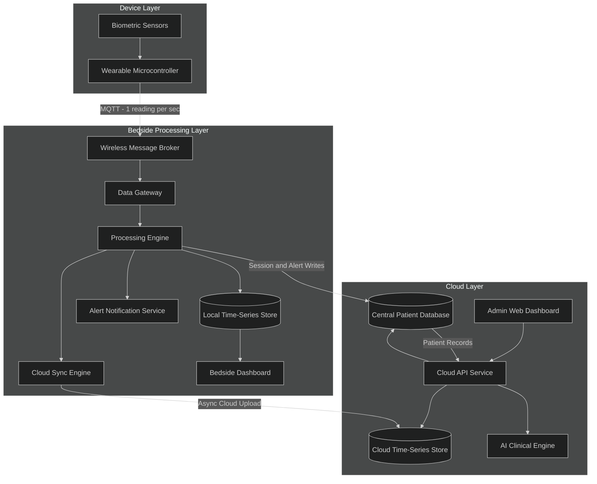

---

## 2. Block Diagram

### 2a. Bedside Processing Pipeline

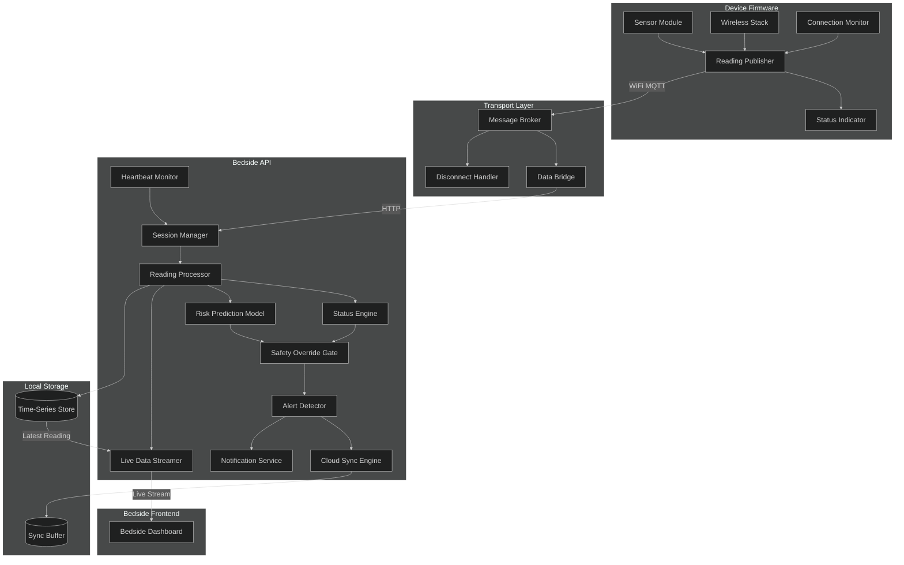

### 2b. Cloud Monitoring Pipeline

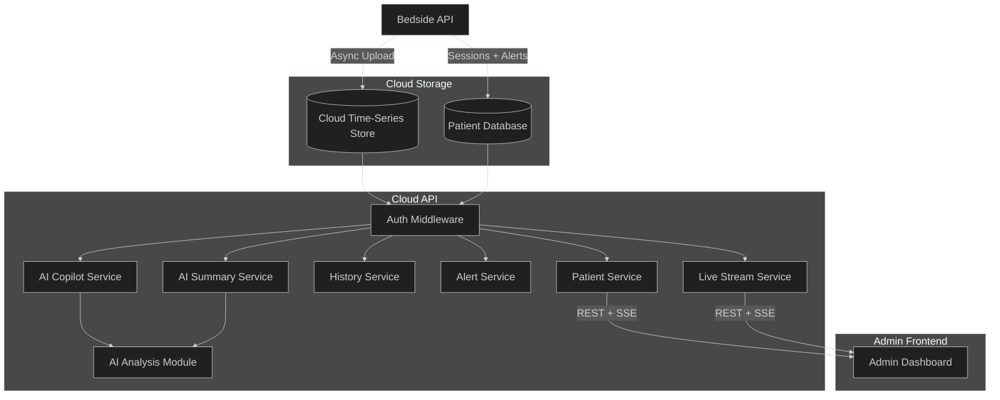

---

## 3. Use Case Diagram

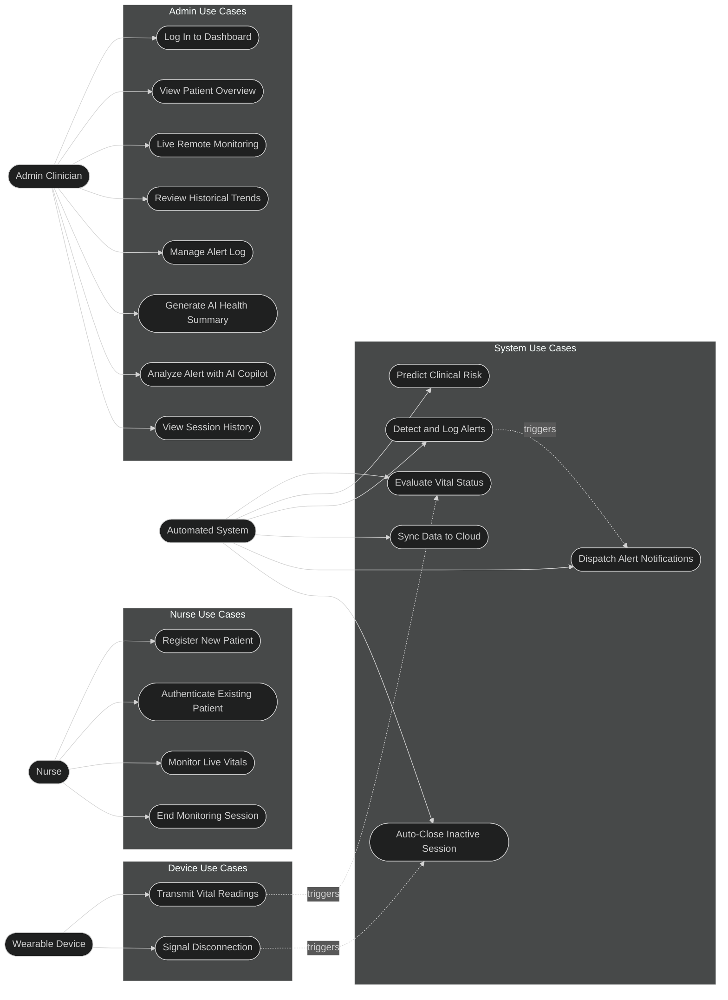

---

## 4. Sequence Diagram

### 4a. Session Initialisation

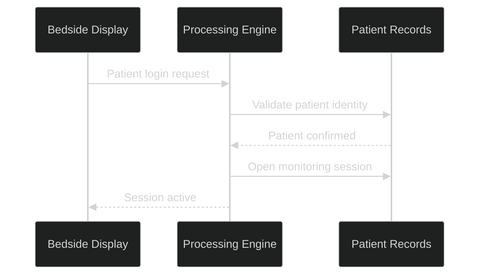

### 4b. Reading Processing Flow

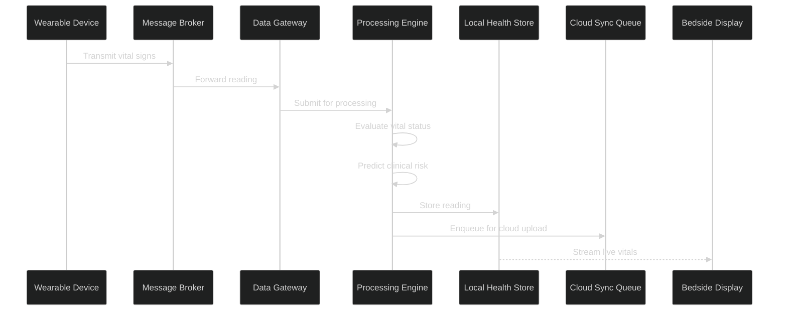

### 4c. Alert Detection

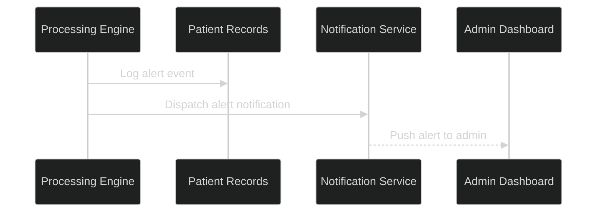

### 4d. Cloud Sync and Admin Monitoring

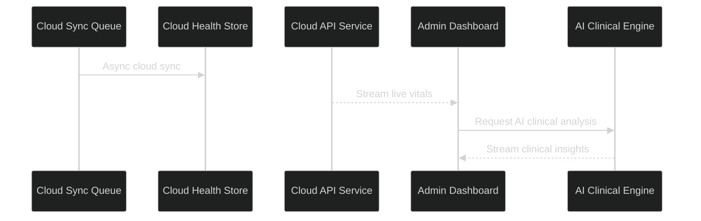

### 4e. Device Disconnection

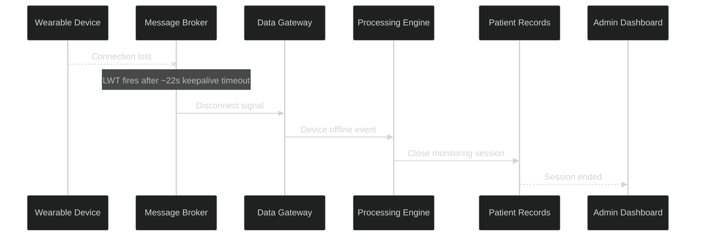

---

## 5. Activity Diagram

### 5a. Session Initialisation

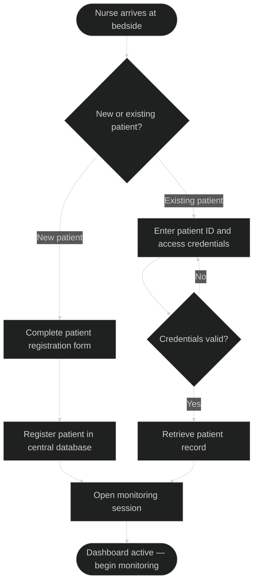

### 5b. Reading Processing Loop

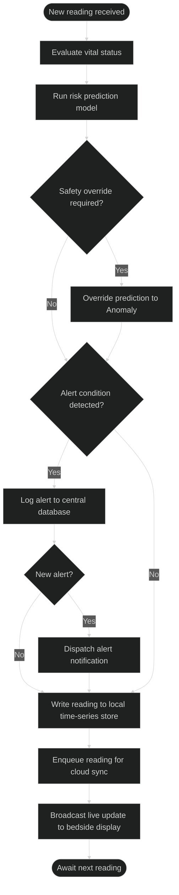

### 5c. Session Termination

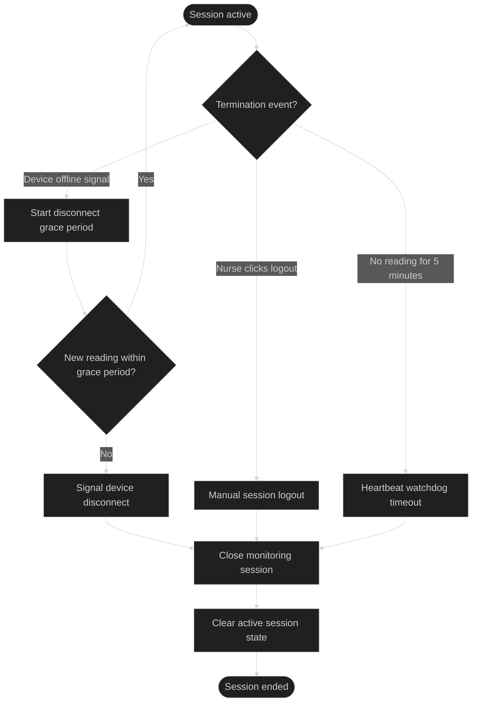

---

## 6. Class Diagram

### 6a. Core Entities and Data Model

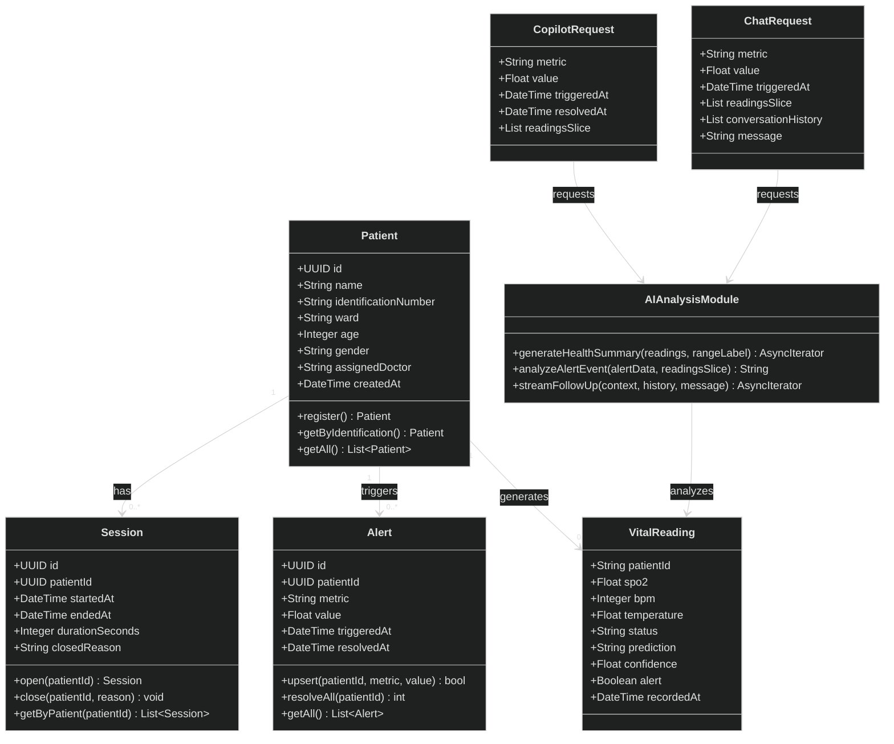

### 6b. Backend Service Infrastructure

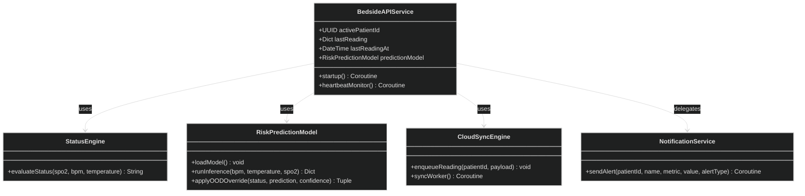

---

## 7. Component Diagram

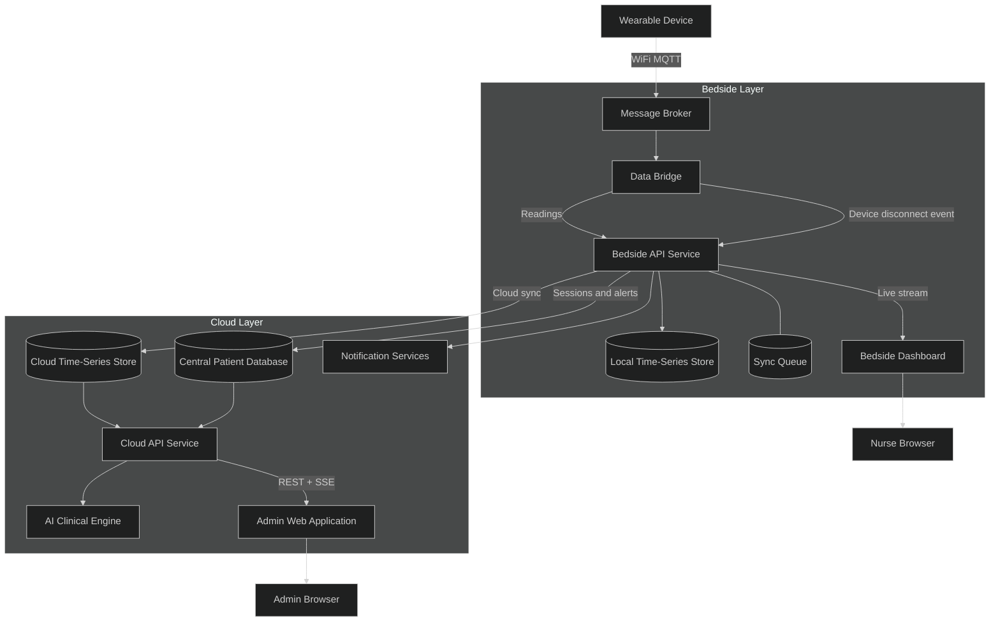

---

## 8. Data Flow Diagram (DFD)

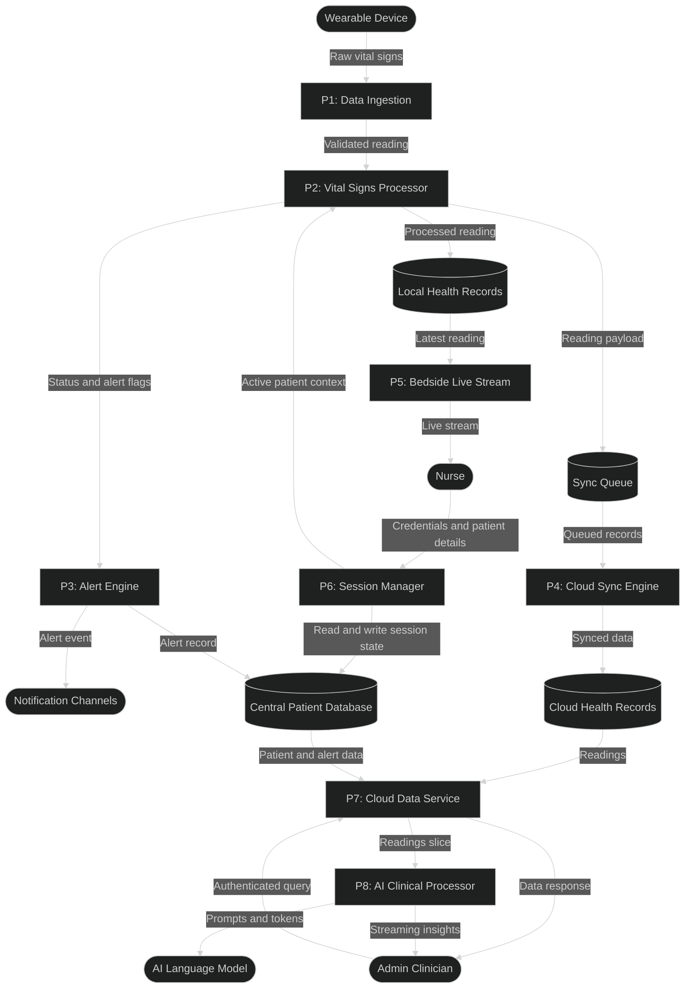

---

## 9. Entity-Relationship (ER) Diagram

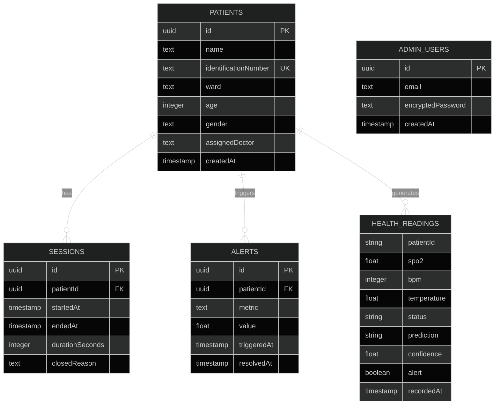

---

## 10. Flowchart

### 10a. Request Validation & Vital Processing

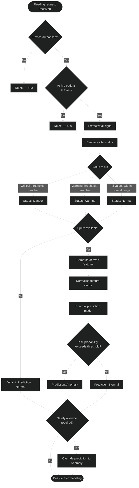

### 10b. Alert Handling & Storage

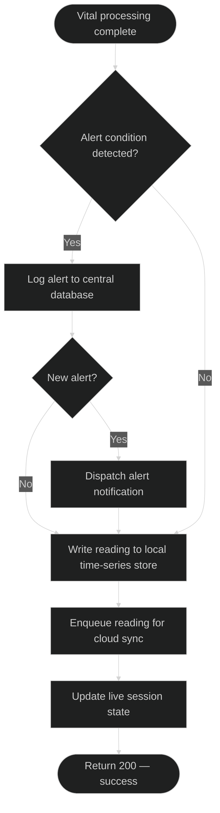

---

## 11. Network Diagram

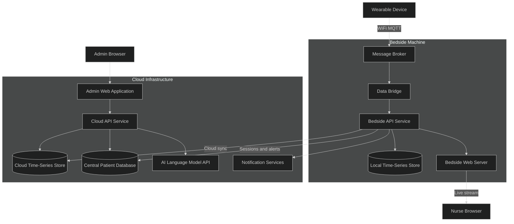

---

## 12. ML Model Architecture Diagram

```mermaid
%%{init: {"theme": "dark", "themeVariables": {"fontSize": "16px"}}}%%
flowchart TD
    INPUT["Raw Vital Signs: Heart Rate, SpO2, Temperature"]

    INPUT --> VALID{SpO2 available?}
    VALID -->|No| NO_SPO2["Output: Normal — SpO2 unavailable"]

    VALID -->|Yes| FEATURES["Feature Engineering"]
    FEATURES --> NORMALISE["Feature Normalisation"]
    NORMALISE --> CLASSIFIER["Binary Risk Classifier"]
    CLASSIFIER --> CALIBRATE["Probability Calibration"]
    CALIBRATE --> THRESHOLD{Exceeds clinical decision threshold?}

    THRESHOLD -->|Yes| PRED_ANOMALY["Prediction: Anomaly"]
    THRESHOLD -->|No| PRED_NORMAL["Prediction: Normal"]

    PRED_NORMAL --> OVERRIDE{Danger status with Normal prediction?}
    OVERRIDE -->|Yes| FORCE["Override to Anomaly"]
    OVERRIDE -->|No| OUT_NORMAL["Output: Normal"]

    PRED_ANOMALY --> OUT_ANOMALY["Output: Anomaly"]
    FORCE --> OUT_ANOMALY
```

---

## 13. Deployment Diagram

```mermaid
%%{init: {"theme": "dark", "themeVariables": {"fontSize": "16px"}}}%%
graph TD
    WEARABLE["Wearable Device"]
    NURSE["Nurse Browser"]
    ADMIN["Admin Browser"]

    subgraph BEDSIDE["Bedside Machine"]
        BROKER["MQTT Message Broker"]
        BRIDGE["Data Bridge"]
        API["Bedside API Service"]
        LOCAL_DB[("Local Time-Series Store")]
        SYNC_Q[("Sync Queue")]
        ML[("AI Risk Prediction Model")]
        DASHBOARD["Bedside Web Server"]
        BROKER --> BRIDGE
        BRIDGE --> API
        API --> LOCAL_DB
        API --- SYNC_Q
        API --- ML
        API --> DASHBOARD
    end

    subgraph CLOUD["Cloud Infrastructure"]
        CLOUD_DB[("Cloud Time-Series Store")]
        PATIENT_DB[("Central Patient Database")]
        CLOUD_API["Cloud API Service"]
        AI_API["AI Language Model API"]
        NOTIFY["Notification Services"]
        ADMIN_WEB["Admin Web Application"]
        CLOUD_DB --> CLOUD_API
        PATIENT_DB --> CLOUD_API
        CLOUD_API --> AI_API
        CLOUD_API --> ADMIN_WEB
    end

    WEARABLE  -->|"WiFi MQTT"| BROKER
    DASHBOARD --> NURSE
    API       -->|"Cloud sync"| CLOUD_DB
    API       -->|"Sessions and alerts"| PATIENT_DB
    API       --> NOTIFY
    ADMIN     --> ADMIN_WEB
```

---

*Generated from MediSync codebase — all 13 diagrams.*
